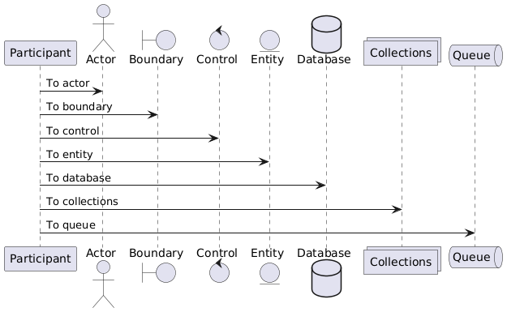

# Tasklist

This application helps you organize creating and accessing tasks for users.

You can access Swagger and see all available endpoints by visiting `http://localhost:8080/swagger-ui/index.html`

## Sequence diagram

## Component diagram

Main application communicates with cache (we use Redis), database (we use Postgresql), storage (we use MinIO).

## Class diagram

We have two main classes - **User** and **Task**.

**User** class represents user in this application. User can log in, create and update tasks.

User can have roles - `ROLE_USER' or 'ROLE_ADMIN`.

**Task** class represents task in this application. Task can be created by user.

Task can have images.

## Environments

To run this application you need to create `.env` file in root directory with next environments:

- `HOST` - host of Postgresql database
- `POSTGRES_USERNAME` - username for Postgresql database
- `POSTGRES_PASSWORD` - password for Postgresql database
- `POSTGRES_DATABASE` - name of Postgresql database
- `POSTGRES_SCHEMA` - name of Postgresql schema
- `REDIS_HOST` - host of Redis instance
- `REDIS_PASSWORD` - password for Redis
- `JWT_SECRET` - secret string for JWT tokens
- `MINIO_BUCKET` - name of bucket for MinIO
- `MINIO_URL` - URL of MinIO instance
- `MINIO_ACCESS_KEY` - access key of MinIO
- `MINIO_SECRET_KEY` - secret key of MinIO
